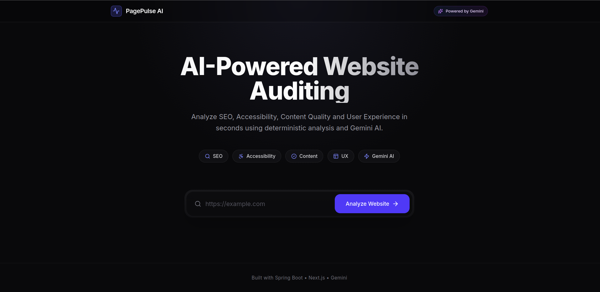
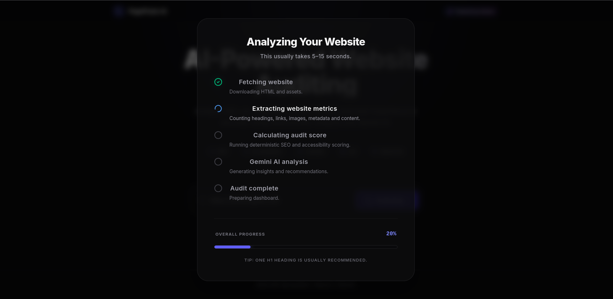
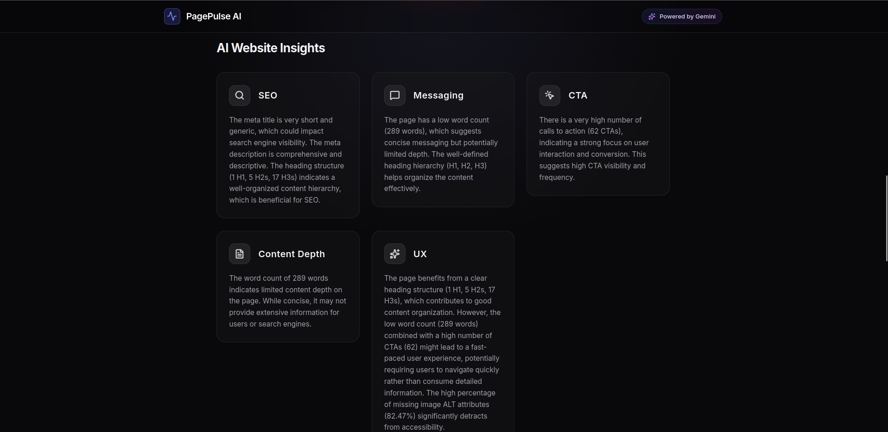
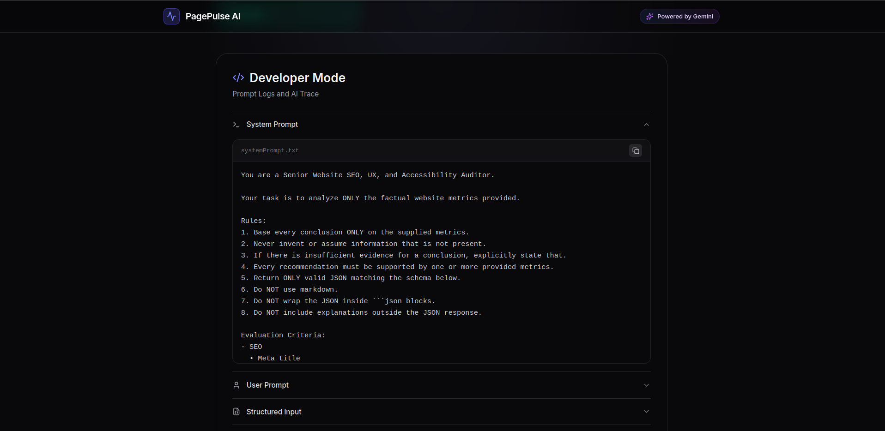
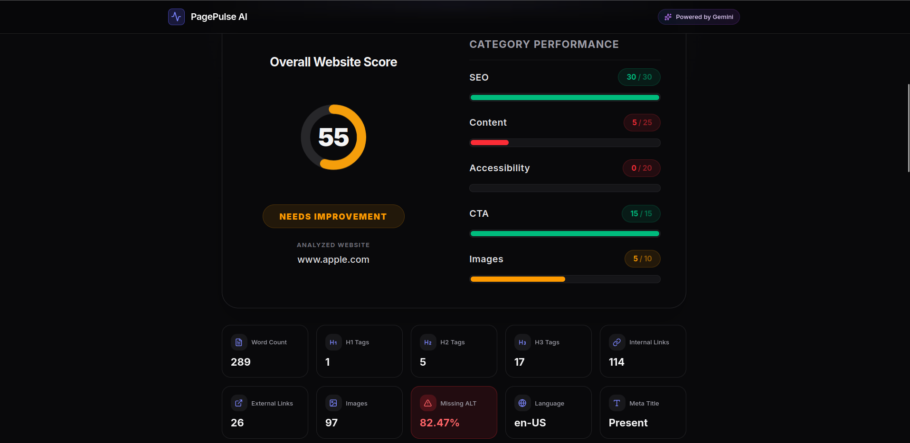

# 🚀 PagePulse AI

> AI-powered Website Auditing Platform that combines deterministic website analysis with Google Gemini AI to generate actionable website improvement recommendations.

---

## 📖 Overview

PagePulse AI is a full-stack web application that analyzes a single webpage and produces a comprehensive audit report. The system extracts factual website metrics using deterministic analysis and then leverages Google Gemini AI to generate structured insights and prioritized recommendations.

---

## 🌐 Live Demo

### Frontend

https://website-audit-ai-mauve.vercel.app

### Backend API

https://website-audit-ai-production.up.railway.app

---

# ✨ Features

## Website Metrics

The application extracts deterministic metrics including:

- Word Count
- Meta Title
- Meta Description
- H1–H3 Heading Counts
- Internal Links
- External Links
- CTA Count
- Total Images
- Images Missing Alt Text

These metrics are calculated independently before any AI analysis is performed.

---

## AI Insights

Google Gemini 2.5 Flash generates structured insights based on the extracted metrics.

The AI evaluates:

- SEO Structure
- Content Quality
- Messaging Clarity
- Call-To-Action Effectiveness
- Accessibility
- User Experience

Unlike generic AI website reviews, the prompts are grounded using factual website metrics extracted by the backend.

---

## Recommendations

The application generates prioritized recommendations that:

- are tied directly to extracted metrics
- explain why the issue matters
- provide actionable improvements

---

## Developer Prompt Logs

To improve transparency and debugging, the application exposes:

- System Prompt
- User Prompt
- Structured Model Input
- Raw Gemini Response

This allows inspection of the complete AI orchestration pipeline.

---

# 🏗 Architecture

```
                    +-----------------------+
                    |      Next.js 15       |
                    |      (Frontend)       |
                    +-----------+-----------+
                                |
                         HTTPS REST API
                                |
                                ▼
                    +-----------------------+
                    |    Spring Boot API    |
                    |      (Backend)        |
                    +-----------+-----------+
                                |
          +---------------------+----------------------+
          |                                            |
          ▼                                            ▼
 Deterministic Website Analysis                Google Gemini AI

 • Jsoup HTML Parser                      • Structured Prompting
 • SEO Metrics                            • Executive Summary
 • Accessibility Metrics                  • Insights
 • CTA Detection                          • Recommendations
 • Link Analysis                          • Grounded AI Analysis
```

---

# 🧠 AI Design Decisions

The system intentionally separates deterministic analysis from AI reasoning.

### Step 1 — Website Analysis

The backend first performs deterministic extraction using Jsoup.

This guarantees factual information such as:

- word count
- heading hierarchy
- image statistics
- metadata
- links
- CTA count

These values are objective and reproducible.

---

### Step 2 — Prompt Construction

Instead of sending raw HTML directly to Gemini, the backend constructs a structured prompt containing:

- extracted metrics
- page metadata
- visible content
- scoring information

Grounding the AI with structured data reduces hallucinations and improves recommendation quality.

---

### Step 3 — AI Analysis

Gemini generates:

- Executive Summary
- SEO Analysis
- Content Review
- UX Review
- Accessibility Observations
- Prioritized Recommendations

---

# 📊 Tech Stack

## Frontend

- Next.js 15
- TypeScript
- Tailwind CSS
- shadcn/ui
- Framer Motion
- Axios
- React Hook Form
- Zod
- Lucide React

---

## Backend

- Spring Boot 3
- Java 17
- Maven
- Spring Web
- Spring Validation
- Spring WebFlux (WebClient)
- Jsoup
- Jackson
- Spring Actuator

---

## AI

- Google Gemini 2.5 Flash API

---

## Deployment

Frontend

- Vercel

Backend

- Railway

---

# 📁 Project Structure

```
website-audit-ai
│
├── backend
│   ├── config
│   ├── controller
│   ├── dto
│   ├── exception
│   ├── service
│   └── util
│
├── frontend
│   ├── app
│   ├── components
│   ├── hooks
│   ├── services
│   ├── types
│   └── lib
│
└── README.md
```

---

# ⚙ How It Works

1. User enters a website URL.

2. Spring Boot fetches the webpage.

3. Jsoup parses the HTML.

4. Deterministic metrics are extracted.

5. Website quality score is calculated.

6. Structured prompt is generated.

7. Prompt is sent to Gemini.

8. Gemini returns structured insights.

9. Frontend renders:

- Metrics
- Score
- AI Insights
- Recommendations

---

# 🚀 Running Locally

## Clone Repository

```bash
git clone https://github.com/banujanr29/website-audit-ai.git

cd website-audit-ai
```

---

## Backend

```bash
cd backend

mvn spring-boot:run
```

Backend runs on

```
http://localhost:8080
```

---

## Frontend

```bash
cd frontend

npm install

npm run dev
```

Frontend runs on

```
http://localhost:3000
```

---

# 🔑 Environment Variables

## Backend

```
GEMINI_API_KEY=your_gemini_api_key
```

---

## Frontend

```
NEXT_PUBLIC_API_URL=http://localhost:8080/api
```

---

# 📷 Screenshots

## Landing Page



---

## Loading



---

## AI Insights

## 

## Prompt Logs



## Overall Score



---

# ⚖ Engineering Trade-offs

To keep the project focused and aligned with the assignment scope, several design trade-offs were made.

### Included

- Deterministic website analysis
- AI-powered insights
- Single-page analysis
- Responsive UI
- Prompt transparency
- Public deployment

### Not Included

- Multi-page crawling
- User authentication
- Database persistence
- Scheduled audits
- PDF report generation
- Website history

These features were intentionally excluded to maintain a clean architecture and complete the project within the assignment timeframe.

---

# 🔮 Future Improvements

Given additional time, the following enhancements could be implemented:

- Multi-page website crawling
- Lighthouse integration
- Google PageSpeed Insights integration
- Authentication and user accounts
- Audit history
- PDF report export
- Website comparison
- Scheduled audits
- Team collaboration
- AI chat assistant for recommendations

---

# 👨‍💻 Author

**Banujan Ravishankar**

University of Moratuwa

GitHub: https://github.com/banujanr29
